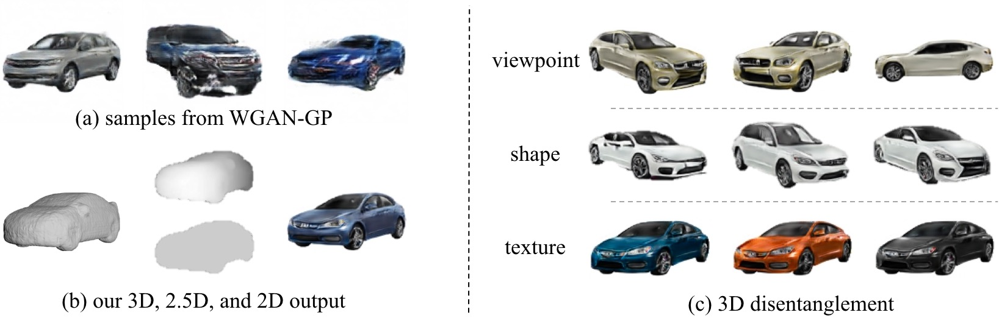
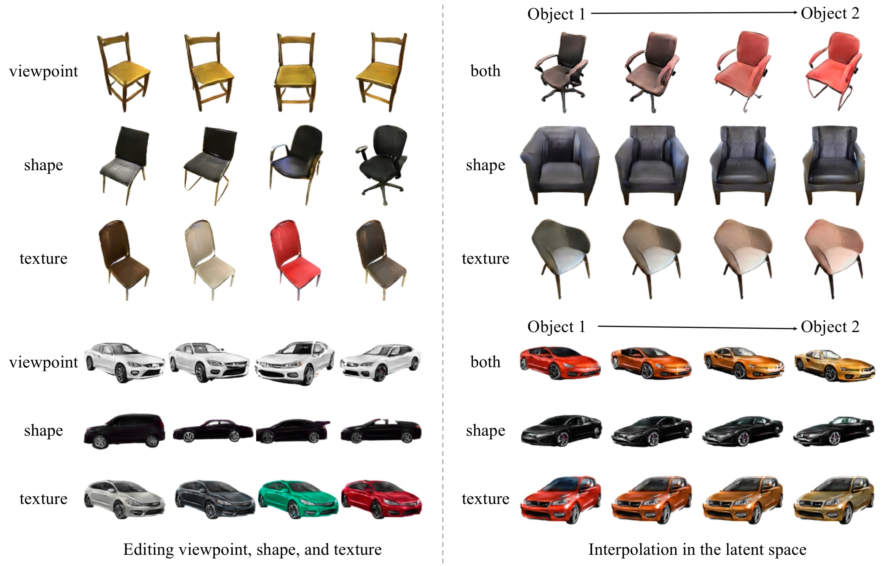

# Visual Object Networks


[Project Page](http://von.csail.mit.edu) |  [Paper](http://arxiv.org/abs/1812.02725)

We present Visual Object Networks (VON), an end-to-end adversarial learning framework that jointly models 3D shapes and 2D images.  Our model can synthesize a 3D shape, its intermediate 2.5D depth representation, and a 2D image all at once. The VON not only generates realistic images but also enables several 3D operations.


Visual Object Networks: Image Generation with Disentangled 3D Representation.<br/>
[Jun-Yan Zhu](http://people.csail.mit.edu/junyanz/),
 [Zhoutong Zhang](https://www.csail.mit.edu/person/zhoutong-zhang), [Chengkai Zhang](https://scholar.google.com/citations?user=rChGGwgAAAAJ&hl=en), [Jiajun Wu](https://jiajunwu.com/), [Antonio Torralba](http://web.mit.edu/torralba/www/), [    Joshua B. Tenenbaum](http://web.mit.edu/cocosci/josh.html), [William T. Freeman](http://billf.mit.edu/).<br/>
MIT CSAIL and Google Research.<br/>
In NeurIPS 2018.

## Example results
(a) Typical examples produced by a recent GAN model [Gulrajani et al., 2017].<br/>
(b) Our model produces three outputs: a 3D shape, its 2.5D projection given a viewpoint, and a final image with realistic texture.<br/>
(c) Given this disentangled 3D representation, our method allows several 3D applications including editing viewpoint, shape, or texture independently.



## More Samples
Below we show more samples from DCGAN [Radford et al., 2016], LSGAN [Mao et al., 2017], WGAN-GP [Gulrajani et al., 2017], and our VON. For our method, we show both 3D shapes and 2D images. The learned 3D prior helps produce better samples.


## 3D Object Manipulations
Our Visual Object Networks (VON) allow several 3D applications such as (left) changing the viewpoint, texture, or shape independently, and (right) interpolating between two objects in shape space, texture space, or both.



## Texture Transfer across Objects and Viewpoints
VON can transfer the texture of a real image to different shapes and viewpoints


## Prerequisites
- Linux (only tested on Ubuntu 16.04)
- Python3 (only tested with python 3.6)
- Anaconda3
- nvcc & gcc(only tested with gcc 6.3.0)
- Pytorch 0.4.1 (does not support 0.4.0)
- Currently not tested with Nvidia RTX GPU serires


## Getting Started ###
### Installation
- Clone this repo:
```bash
git clone -b master --single-branch https://github.com/junyanz/VON.git
cd VON
```
- Install PyTorch 0.4.1+ and torchvision from http://pytorch.org and other dependencies (e.g., [visdom](https://github.com/facebookresearch/visdom) and [dominate](https://github.com/Knio/dominate)). You can install all the dependencies by the following:
```bash
conda create --name von --file pkg_specs.txt
source activate von
```

- Compile the rendering kernel by the following:
```bash
./install.sh
```


- (Optional) Install [blender](https://www.blender.org/) for visualizing generated 3D shapes. After installation, please add blender to your PATH environment variable.

### Generate 3D shapes, 2.5D sketches, and images
- Download our pretrained models:
```bash
bash ./scripts/download_model.sh
```

- Generate results with the model
```
bash ./scripts/figures.sh 0 car df
```

The test results will be saved to an HTML file here: `./results/*/*/index.html`.

### Model Training
- To train a model, download the training dataset (distance functions and images). For example, if we would like to train a car model with distance function representation on GPU 0.
```bash
bash ./scripts/download_dataset.sh
```
- To train a 3D generator:
```bash
bash ./scripts/train_shapes.sh 0 car df
```
- To train a 2D texture network using ShapeNet real shapes:
```bash
bash ./scripts/train_stage2_real.sh 0 car df
```

- To train a 2D texture network using pre-trained 3D generator:
```bash
bash ./scripts/train_stage2.sh 0 car df
```

- Jointly finetune 3D and 2D generative models:
```bash
bash ./scripts/train_full.sh 0 car df
```

- To view training results and loss plots, go to http://localhost:8097 in a web browser. To see more intermediate results, check out  `./checkpoints/*/web/index.html`


### Citation

If you find this useful for your research, please cite the following paper.
```
@inproceedings{VON,
  title={Visual Object Networks: Image Generation with Disentangled 3{D} Representations},
  author={Jun-Yan Zhu and Zhoutong Zhang and Chengkai Zhang and Jiajun Wu and Antonio Torralba and Joshua B. Tenenbaum and William T. Freeman},
  booktitle={Advances in Neural Information Processing Systems (NeurIPS)},
  year={2018}
}

```

### Acknowledgements
This work is supported by NSF #1231216, NSF #1524817, ONR MURI N00014-16-1-2007, Toyota Research Institute, Shell, and Facebook. We thank Xiuming Zhang, Richard Zhang, David Bau, and Zhuang Liu for valuable discussions. This code borrows from the [CycleGAN & pix2pix](https://github.com/junyanz/pytorch-CycleGAN-and-pix2pix) repo.
